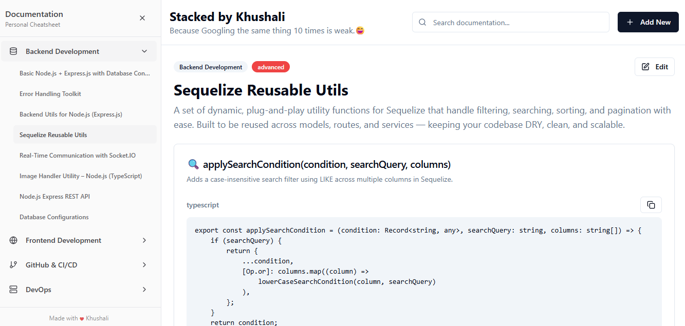

# Stacked by Khushali

A beautiful, modern, and personal documentation/cheatsheet app for developers. Organize, search, and quickly access your DevOps, Backend, Frontend, GitHub, and Config knowledge in one place. Built with React, TypeScript, Tailwind CSS, and Vite.

---



## ✨ Features

- 🗂️ **Organized Sections:** DevOps, Backend, Frontend, GitHub, Config, and more
- 🔍 **Powerful Search:** Instant search with keyword highlighting and keyboard navigation
- 📝 **Add/Edit Topics:** Easily add, edit, or remove documentation topics
- 📋 **Copy Code:** One-click copy for code snippets and solutions
- 💡 **Troubleshooting:** Store common issues and solutions for quick reference
- 📱 **Responsive UI:** Works great on desktop and mobile
- 🎨 **Modern Design:** Clean, minimal, and beautiful interface
- ❤️ **Made with Love by Khushali**

---

## 🚀 Getting Started

### 1. Clone the Repository

```sh
# Using git
 git clone https://github.com/KhushaliTrivedi/stacked-by-khushali.git
 cd stacked-by-khushali
```

### 2. Install Dependencies

```sh
npm install
# or
yarn install
# or
bun install
```

### 3. Start the Development Server

```sh
npm run dev
# or
yarn dev
# or
bun run dev
```

Open [http://localhost:8080/](http://localhost:8080/) in your browser.

---

## 🛠️ Project Structure

```
├── src/
│   ├── components/         # UI components (Sidebar, ContentArea, etc.)
│   ├── contexts/           # React context (SearchContext)
│   ├── data/               # Documentation data (edit/add your topics here)
│   ├── hooks/              # Custom React hooks
│   ├── pages/              # App pages (AddNew, Index, NotFound)
│   ├── utils/              # Utility functions (search, highlight, etc.)
│   └── App.tsx             # Main app entry
├── public/                 # Static assets
├── README.md               # This file
└── ...
```

---

## ✍️ How to Add Your Own Docs

- Edit `src/data/documentationData.ts` to add, update, or remove sections and topics.
- Use the app's UI to add/edit topics and copy the generated object for easy manual updates.

---

## 📦 Built With

- [React](https://react.dev/)
- [TypeScript](https://www.typescriptlang.org/)
- [Vite](https://vitejs.dev/)
- [Tailwind CSS](https://tailwindcss.com/)
- [Lucide Icons](https://lucide.dev/)

---

## 🤝 Contributing

Pull requests are welcome! For major changes, please open an issue first to discuss what you would like to change.

---

## 📄 License

MIT

---

<div align="center">
  <sub>Made with <span style="color: #e25555; font-size: 1.1em; vertical-align: middle;">♥</span> by Khushali</sub>
</div>
